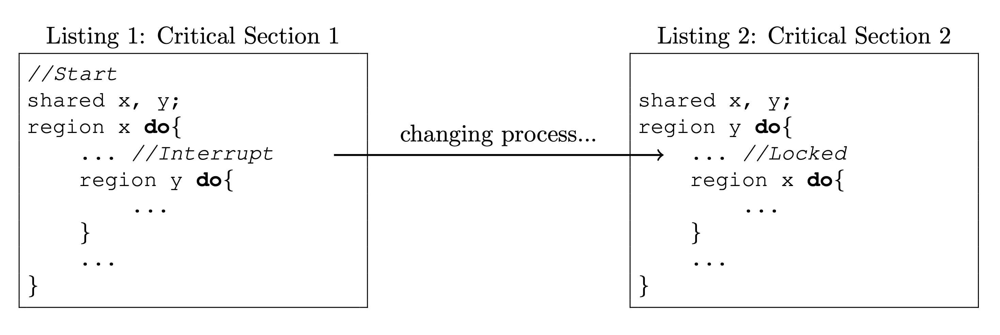
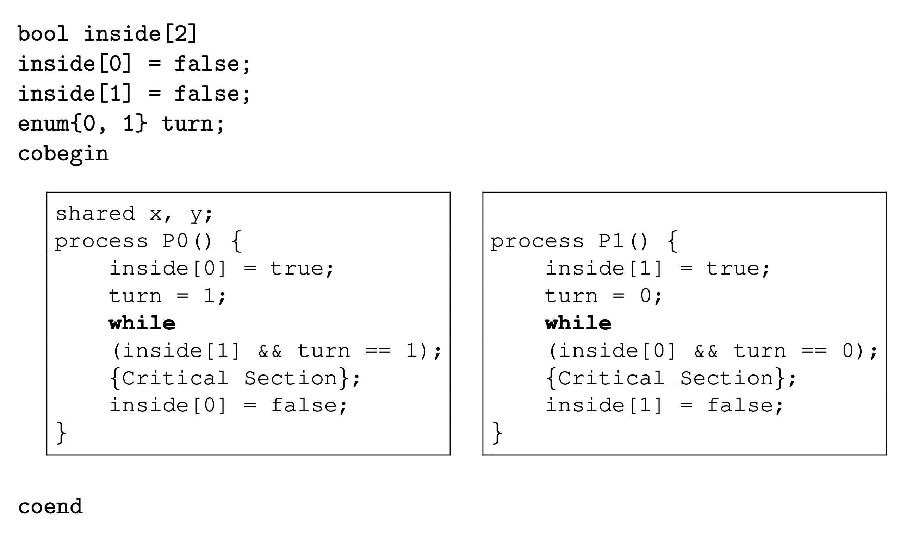

# 程序的并发

## 顺序程序设计与并发程序设计

与并发程序设计相对应的是顺序程序设计。这种程序设计方式在我们一开始学习一门传统的编程语言（如 `C` 和 `Java` 等）的时候就已经接触到了。程序按照**一定的顺序**执行，每一步的执行都是有序的，不会出现多个步骤同时执行的情况。

::: tip 顺序程序设计的特性

- 程序执行的**顺序性**：程序指令执行是严格按顺序的；
- 计算环境的**封闭性**：程序运行时如同独占受操作系统保护的资源；
- 计算结果的**确定性**：程序执行结果与执行速度和执行时段无关；
- 计算过程的**可再见性**：程序对相同数据集的执行轨迹是确定的。

:::

但是，这种程序设计方式具有很大的局限性。这主要是因为采取这种方式的程序设计，程序的执行**效率**会受到很大的限制：程序的执行速度可能会被某些部分所拖慢，从而导致整个程序的执行效率降低。但实际上，有很多时候，我们的程序并不需要按照一定的顺序执行，而是可以在等待某些操作完成的时候，去做其他的事情。这就是一种**统筹安排**的思想，它相当于对处理器资源进行**分时复用**。

另一方面，许多程序之间的关系是**并发**的，即多个程序之间的执行是相互独立的，但它们之间又有一定的联系。这种联系在于对**某些数据的控制**上。这种情况下，如果我们仍然采用顺序程序设计的方式而没有考虑并发性，那么很可能产生错误。

此外，目前的计算机硬件已经发展到了多核、多处理器时代，这就意味着我们可以同时执行多个任务。如果我们仍然采用顺序程序设计的方式，那么我们也无法充分利用计算机的性能。采取并发程序设计的方式，可以让处理器的**多个核心协同工作**，提高效率。

由此，我们可以总结为：**并发指同一个系统中拥有多个同时执行的、具有潜在交互特性的程序，因此系统会有相当多个执行路径且结果可能具有不确定性。并发程序可能会在具备多核心的同一个晶片中交錯运行，以时分复用方式在同一个处理器中執行，或在不同的处理器执行。**

## 并发程序设计的思想

并发程序设计的核心就是要考虑**多个程序同时执行**的问题。例如，一个程序执行第一条指令是在另一个程序执行完最后一条指令之前开始的，那么这两个程序就可以看作是同时执行的。这时，这两个程序就有可能失去顺序程序中的**顺序性、封闭性、确定性和可再现性**。因此，并发程序设计就是要解决这一问题，在多个程序同时执行的情况下，尽可能保证它们各自的**封闭性、确定性和可再现性**

在解决这一问题的前提下，我们还需要考虑如何**合理地利用计算机的资源**，提高程序的执行效率。这就需要我们对程序的执行过程进行**合理的安排**。

并发程序设计的主要思想就是**保证程序实现的正确性**和**提高效率**。

## 并发程序设计的特点

::: tip 并发程序设计的特性
- **并行性**：多个进程在多道程序系统中并发执行或者在多处理器系统中并行执行，提高了计算效率；
- **共享性**：多个进程共享软件资源；
- **交往性**：多个进程并发执行时存在制约，增加了程序设计的难度。

:::

::: tip 并发程序设计的优点
- 对于单处理器系统，能够有效利用资源，让处理器和设备、设备和设备同时工作，充分发挥硬件设备的并行工作能力；
- 对于多处理器系统，能够让进程在不同处理器上物理地并行工作，加快计算速度；
- 某些情况下，可以简化程序设计。
:::

## 并发进程间的制约关系

要保证并发程序实现的正确性，就首先要厘清并发进程间的**制约关系**。

### 无关与交往的并发进程

一般来说，并发进程之间的关系可以分为**无关的**和**交往的**。

- **无关的**并发进程：一组并发进程分别在不同的变量集合上运行，一个进程的执行与其他并发进程的进展无关。

- **交往的**并发进程：一组并发进程共享某些变量，一个进程的执行可能影响其他并发进程的结果。

可以利用 $\mathrm{Bernstein}$ 条件来判断两个进程是**无关的**还是**交往的**。

### $\mathrm{Bernstein}$ 条件

设 $R(P_i)=\{a_1,a_2,\cdots,a_n\}$ 为进程 $P_i$ 所引用（读取）的变量集合，$W(P_i)=\{b_1,b_2,\cdots,b_m\}$ 为为进程 $P_i$ 所修改（写入）的变量集合。则这两个进程 $P_i$ 和 $P_j$ 满足 $\mathrm{Bernstein}$ 条件的**充要条件**是

$$
\underbrace{R(P_i)\cap W(P_j)}_{\left \langle 1 \right \rangle } \cup \underbrace{W(P_i)\cap R(P_j)}_{\left \langle 2 \right \rangle } \cup \underbrace{W(P_i)\cap W(P_j)}_{\left \langle 3 \right \rangle } = \emptyset
$$

$\langle 1 \rangle$ 和 $\langle 2 \rangle$ 表明了，两个进程之间的**读写操作**在不同的变量集合上进行；$\langle 3 \rangle$ 表明了，两个进程之间的**写操作**在不同的变量集合上进行。这样进程之间的相对执行顺序就可以任意改变，即进程的执行与时间无关，并发执行的程序可以保持**封闭性、确定性和可再现性**。

### 如果不满足 $\mathrm{Bernstein}$ 条件……

那么，它们就是一组**交往的**并发进程。对于一组交往的并发进程，执行的**时机**与**相对速度**无法得到控制。如果程序设计不当，可能出现各种[”与时间有关的”错误](./并发的概念#与时间有关的-错误)。

### 进程的竞争与协作

进程之间存在两种基本关系：竞争关系和协作关系
- 第一种是**竞争**关系，一个进程的执行可能影响到同其竞争资源的其他进程，如果两个进程要访问同一资源，那么，一个进程通过操作系统分配得到该资源，另一个将不得不**等待**。这需要通过**互斥**来解决；
- 第二种是**协作**关系，某些进程为完成同一任务需要分工协作，由于合作的每一个进程都是独立地以不可预知的速度推进，这就需要相互协作的进程在某些协调点上协调各自的工作。当合作进程中的一个到达协调点后，在尚未得到其伙伴进程发来的消息或信号之前应阻塞自己，直到其他合作进程发来协调信号或消息后方被唤醒并继续执行。这需要通过**同步**来解决。

### 竞争关系带来的问题

- 第一种是**死锁** $\mathrm{(Deadlock)}$ 问题：一组进程如果都获得了部分资源，还想要得到其他进程所占有的资源，最终所有的进程将陷入死锁；
- 第二种是**饥饿** $\mathrm{(Starvation)}$ 问题：一个进程由于其他进程总是优先于它而被无限期拖延。
  
操作系统需要保证所有进程都能互斥地访问临界资源，既要解决饥饿问题，又要解决死锁问题。

## “与时间有关的”错误

与时间有关的错误具体表现为两种：**结果出错**和**永远等待（死锁）**。

### 结果出错

比如，网上银行一个最基本的功能就是从账户中取款。一个最简单的模型可以用以下的代码来表示。

```c
int withdraw(int money){
    if(account.balance > money){
        account.banlance -= money;
        return money;//成功取出
    }else{
        return -1;//余额不足
    }
}
```

但此时有用户连续进行两次取款，如果服务器采取并发执行，就有可能导致出错。例如某用户账户余额 $\mathrm{account}_{balance}$ 为 $7$，在两个进程下执行 $\mathrm{withdraw}(5)$，则可能产生以下的问题：

::: code-group
```c [进程1]
int withdraw(int money){    //(1) 首先执行进程1 // [!code warning]
    if(account.balance > money){    //(2) 7 > 5，进入这一代码块
        //(3) 进程2开始执行 // [!code warning]
        //(8) 进程2执行完毕 // [!code warning]
        account.banlance -= money;//(9) 2 - 5 = -3，执行修改，出现错误！！ // [!code error]
        return money;
    }else{
        return -1;
    }
}
```

```c [进程2]
int withdraw(int money){    //(4) 进程2开始执行 // [!code warning]
    if(account.balance > money){    //(5) 由于进程1还没有对account.banlance进行修改，因此仍是7>5，进入这一代码块
        account.banlance -= money;  //(6) 7 - 5 = 2，执行修改
        return money;   //(7) 返回5，进程2结束，返回到进程1 // [!code warning]
    }else{
        return -1;
    }
}
```
:::

在这个例子中，由于我们无法控制两个进程的执行时机、执行速度与切换时机，如果凑巧发生了上述的情况，就会使账户的余额出现问题。按理来说，进程 $2$ 应该返回余额不足，但它进行了扣款并产生了错误的结果，这就是**结果出错**。

### 永远等待

考虑一个主存资源申请和归还的问题。其中 $\mathrm{borrow(B)}$ 代表从主存池中申请大小为 $B$ 的内存空间，$\mathrm{return(B)}$ 代表从主存池中归还大小为 $B$ 的内存空间。那么，以下的代码可能产生问题：

::: code-group 
```c [borrow]
void borrow(int B){
    while(B > avaliableMem){
        {进程进入等待主存资源队列};
    }
    avaliableMem -= B;
    {修改主存分配表，进程获得主存资源};
}
```

```c [return]
void return(int B){
    avaliableMem += B;
    {修改主存分配表};
    {查等待主存资源队列，释放等主存资源进程};
}
```
:::

比如，$\mathrm{borrow(B)}$ 借取了一个超过 $\mathrm{avaliableMem}$ 的主存空间。但在执行 $\{进程进入等待主存资源队列\}$ 前，另一个进程调用 $\mathrm{return(B)}$ 抢先执行，归还所借全部主存资源。这时，由于前一个进程还未成为等待者，$\mathrm{return(B)}$ 中的$\{释放等主存资源进程\}$ 相当于空操作，但前一个进程已经出队，可能再也不会被释放，这就造成了前一个进程**永远等待**。

::: details “悲观者永远正确”
从前文的例子可以看出一种现象，即它们发生的条件似乎都比较苛刻。这也是并发程序设计中一种典型的思考模式，即以一种**悲观**的视角来考虑问题。原因很简单，我们希望尽可能消除并发带来的不良影响。

因此，在初期学习并发时，请牢记“**墨菲定律**”。
:::

# 临界区

## 临界区的概念

并发进程中与共享变量有关的程序段叫“**临界区**”，共享变量代表的资源叫“**临界资源**”。临界区的概念一般与进程的**竞争**有关：多个并发进程访问临界资源时，存在竞争制约关系；如果两个进程同时停留在相关的临界区内，就可能出现与时间相关的错误。

临界区和临界资源的概念是由荷兰计算机科学家 $\mathrm{Dijkstra}$ 提出的。在并发程序设计中，我们可以用以下的方式来形式化地定义临界区和临界资源：

```txt:line-numbers
shared <varialbe>
region <varialbe> do <statement_list>
```

临界区的概念是为了解决并发程序设计中的**竞争**问题。在临界区内，同一时刻只允许一个进程访问临界资源，其他进程若要访问必须等待。这样，就可以保证临界资源的访问是**互斥**的。具体来说，临界区的访问需要满足以下的条件：

- **互斥性**：在任意时刻，只允许一个进程进入临界区。如果已经有进程进入临界区，其他进程必须排队等待；
- **有限停留**：进程在进入临界区后，必须在有限时间内退出，不可无限期占用临界资源；
- **有限等待**：一个进程不能无限地等待进入临界区。

至于**不相关**的临界区（即临界资源无交集的临界区），可以同时执行，不需要互斥。

::: details 临界区的嵌套
临界区是可以嵌套的，但嵌套不当会造成死锁。例如下面的情况，如果两个进程几乎同时分别进入了 `critical section 1` 和 `critical section 2`，那么就可能造成死锁。因为进入最外层的临界区是可以并行的（临界区不相关），所以这两个进程可以同时进入最外层的临界区。但当它们都进入了最外层的临界区后，就无法再进入内层临界区了，从而造成死锁。


:::

## 软件模拟临界区管理

使用 $\mathrm{Peterson}$ 算法可以大致模拟两个进程互斥使用一个临界区，但该算法的通用性和效率较差。



其中，$\mathrm{cobegin}$ 和 $\mathrm{coend}$ 表示这当中的进程是一组并发的进程。指示器 $\mathrm{turn}$ 用来指示可以由哪个进程进入临界区，而 $\mathrm{inside[0]}$ 和 $\mathrm{inside[1]}$ 用来表示两个进程是否已经进入临界区。可以看出，$\mathrm{P0}$ 和 $\mathrm{P1}$ 使用临界区的次序变成了完全一比一的交替方式。如果有多个进程一同抢占这一临界区，那么这个算法就会变得比较复杂，效率可能也会比较低下。

## 硬件支持的临界区管理

实现临界区管理的硬件设施主要有三种：**关中断**、**测试并建立指令**以及**对换指令**

### 关中断

关中断是实现互斥的**最简单方法**。在进入临界区之前，关闭中断；在退出临界区之后，再打开中断。这样，即使有多个进程同时进入临界区，也不会出现竞争问题。但是，这种方法的效率较低，因为关闭中断会导致系统的其他部分也无法运行。并且将中断交付给用户程序处理，可能会导致系统的不稳定甚至全盘崩溃。

### 测试并建立指令

这一方式主要是通过 $\mathrm{TS}$ 指令来实现的。大致的思路是，进程在进入临界区之前，先测试一个变量是否为 $\mathrm{true}$，如果是，则将其设置为 $\mathrm{false}$，进入临界区；如果不是，则等待。在退出临界区之后，将这个变量设置为 $\mathrm{true}$（有点类似**锁存器**）。这样，即使有多个进程同时进入临界区，也不会出现竞争问题。

::: code-group
```c [TS指令的处理过程]
bool TS(bool &x){
    if(x){
        x=false;
        return true;
    } else
        return false; 
}
```

```c [TS指令实现进程互斥]
bool s = true;
cobegin
process Pi(){ //i=1,2,...,n
    while(!TS(s)); //上锁 
    {临界区};
    s = true; //开锁
} 
coend
```
:::


### 对换指令

考虑给每个进程分配一个 $\mathrm{key}$，初始化为 $\mathrm{false}$。为临界区设置一个 $\mathrm{lock}$，初始化为 $\mathrm{true}$。当进程希望进入临界区时，先把自己的 $\mathrm{key}$ 和 $\mathrm{lock}$ 交换，如果换到了不一样的，就进入临界区，否则等待。在退出临界区时，再把 $\mathrm{key}$ 和 $\mathrm{lock}$ 交换一次，恢复原状。这样就保证了互斥性。

```c
bool lock = false;
cobegin
Process Pi(){ //i=1,2,...,n
    bool keyi=true; //进程自己的key
    do {
        SWAP(keyi,lock);
    }while(keyi); //上锁
    {临界区};
    SWAP(keyi,lock); //开锁 
}
coend
```